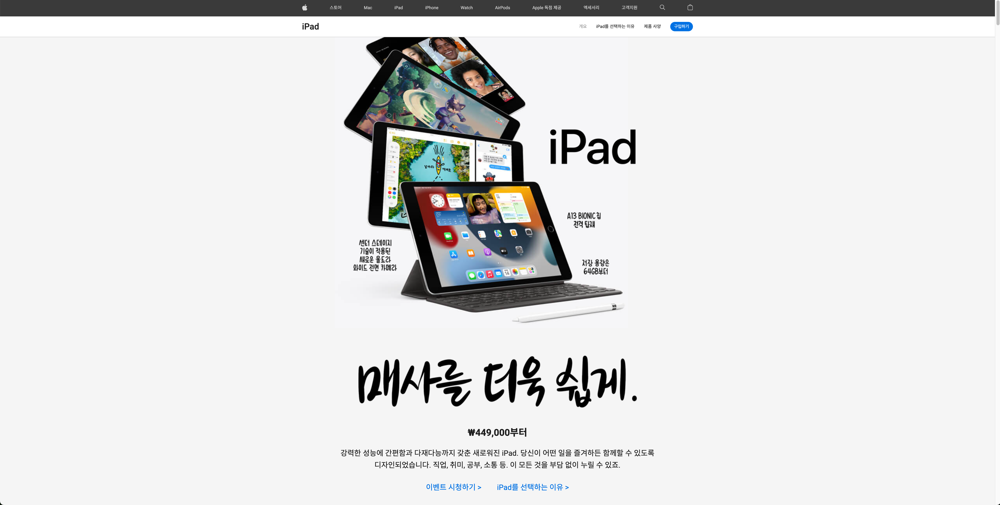

# 🍎 iPad 제품 소개 클론 사이트

Apple 공식 iPad 소개 페이지를 참고하여 제작한 클론 웹사이트입니다.  
HTML, CSS, JavaScript를 활용하여 정적인 UI를 구현하고, 반응형 레이아웃과 간단한 사용자 인터랙션을 포함하였습니다.

 <!-- 프로젝트 이미지 있으면 해당 경로에 추가 -->

---
## 배포 사이트
https://ipad-azure-two.vercel.app/

---

## 📌 프로젝트 개요

- **목적:** 브랜드 웹사이트 클론 코딩을 통해 반응형 웹 제작과 레이아웃 구성 능력을 향상시키기 위함입니다.
- **대상:** Apple iPad 소개 페이지 (https://www.apple.com/kr/ipad/)
- **범위:** 단일 페이지(static page), 애니메이션/이벤트 일부 구현 포함
- **특징:**  
  - 시맨틱한 HTML 구조  
  - CSS Flexbox 및 Grid를 활용한 레이아웃  
  - 반응형 (Responsive) 웹 설계  
  - JavaScript로 메뉴 토글 등 인터랙션 구현  

---

## 🛠️ 사용 기술

| 영역       | 기술 |
|------------|------|
| 마크업     | HTML5 |
| 스타일링   | CSS3 (Flexbox, Media Queries, Animation) |
| 스크립트   | JavaScript (Vanilla) |

---

## 📂 폴더 구조

```
ipad/
├── css/                    # 스타일 파일
│   └── style.css           # 메인 스타일 정의
│
├── js/                     # 자바스크립트 파일
│   └── main.js             # 상단 메뉴 버튼 등의 기능 구현
│
├── images/                 # 사용된 이미지 리소스
│   ├── hero_ipad.png
│   ├── logo_apple.png
│   ├── section1.png
│   └── ...                 # 기타 이미지들
│
├── index.html              # 메인 HTML 파일
└── README.md               # 프로젝트 설명서 (현재 문서)
```

---

## 💡 주요 기능 설명

- **상단 내비게이션 바**  
  - Apple 로고, 메뉴 버튼 구성  
  - JavaScript로 메뉴 토글 기능 구현

- **Hero 섹션**  
  - iPad 메인 이미지와 대표 슬로건 표시  
  - 중앙 정렬 및 비주얼 강조 디자인

- **제품 특징 섹션**  
  - 아이패드 성능, 액세서리, 호환성 등 소개  
  - 텍스트 + 이미지 조합

- **반응형 구현**  
  - 화면 크기에 따라 레이아웃이 유동적으로 변함  
  - 모바일, 태블릿 환경 대응

---

## ✅ 실행 방법

1. GitHub 저장소 클론

   ```bash
   git clone https://github.com/smyuDev/ipad.git
   ```

2. 프로젝트 폴더로 이동

   ```bash
   cd ipad
   ```

3. 브라우저에서 `index.html` 파일 열기

   - Visual Studio Code 등의 에디터에서 `Live Server` 확장 기능을 사용해도 좋습니다.
   - 또는 `index.html`을 브라우저에 드래그해서 실행하세요.

---

## 🧪 개선 여지 (To-do)

- 메뉴 드롭다운 등 더 복잡한 인터랙션 추가  
- 애니메이션 및 전환 효과 강화  
- 페이지 내 링크 기능 활성화  
- 다국어 지원 (i18n) 기능

---

## ⚠️ 참고 사항

- 이 프로젝트는 학습 목적의 **비상업용 클론코딩**입니다.
- Apple 및 그 브랜드와는 아무런 관련이 없습니다.
- 원본 사이트: [https://www.apple.com/kr/ipad/](https://www.apple.com/kr/ipad/)

---

## 📄 라이선스

해당 프로젝트는 [MIT License](LICENSE)를 따릅니다. 자유롭게 활용하되, 상업적 이용 시에는 원 저작권을 참고해 주세요.